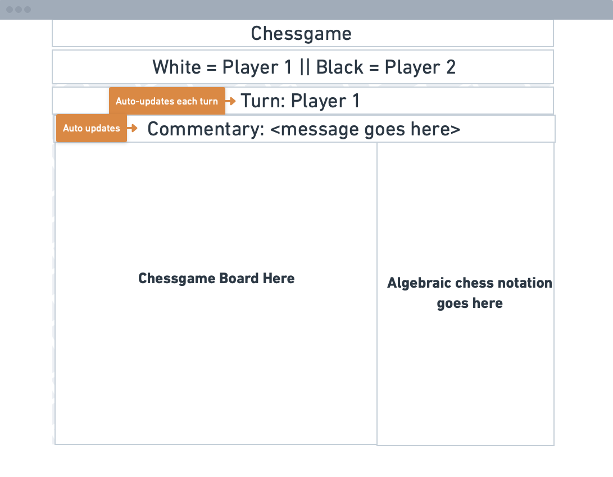

## Table of contents

-   [General info](#general-info)
-   [Chess game Link](#Chess-game-link)
-   [Screenshots](#screenshots)
-   [To Do or Future Items](#to-do)
-   [Approach Taken](#approach-taken)
-   [Wireframe](#wireframe)
-   [In-depth Features of Chess](#in-depth-features-of-BeerBuddy)
-   [Challenges](#challenges)
-   [Technologies Used](#technologies-used)
-   [Download](#download)

## General info

This project is to demonstrate Node JS, React JS, components, classes by the use of a chess game.

## Chess game link

-   The link to the Chess online game is via:
    [http://medievalchess.surge.sh/]
-   Public access to the Git respository is via:
    [https://github.com/mistergjones/chessgame]

## Screenshots

## To-Do / Future Items

1. Implement Check and Checkmate functionality.
2. Enable paws to move "en passant" and move 2 sqaures from their initial spots.
3. Implement the commonly used chess notation for recording moves.
4. Enable React to store session state so if a player were to hit "refresh", the game does not reset.
5. Implement a "Save" and "Load" game feature linked to a database.
6. Via websockets, enabling real-time playing over the internet.

## Approach Taken

1. Based on a classic chessboard game, constructed a simple wireframe diagram with a couple of headings, a gameboard and an area for game movement positions.

## Wireframe

## In-depth Features of Chess game

-   Players take turns to move their pieces and ultimately place their opponents King in checkmate or until they resign.

## Challenges

-   Implementing the full suite of all the rules of chess in a short period of time was not feasible. Therefore, the rudimentaries were the MVP for this application.
-   Difficult deploying to Heroku but went with surge.sh instead given that there is no server/backend technologies required as part of this application.

## Technologies Used

Project is created with:

1. Javascript
2. React JS
3. Node JS
4. HTML/CSS

Deployment:

1. surge.sh

Version Control:

1. Git / Github

## Download

Download Source Code via:

-   https://github.com/mistergjones/chessgame.git
